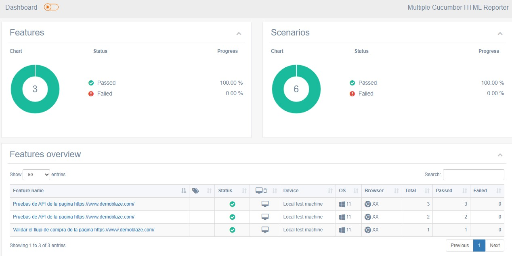

# QA Examen Práctico TCS

Proyecto de automatización de pruebas integrando el framework Cypress.io, Cucumber y BDD.

## Tabla de Contenidos

- [Requisitos del Sistema](#requisitos-del-sistema)
- [Instalación](#instalación)
- [Uso](#uso)
- [Ejemplos](#ejemplos)
- [Estado del Proyecto](#estado-del-proyecto)
- [Contacto](#contacto)

## Requisitos del Sistema

* Node.js - v18.16.0
* Navegadores compatibles: Chrome, Firefox, Edge, Electron
* cucumber-json-formatter-windows-amd64


## Instalación

Descargarse el proyecto compartido disponible en:_____

``` [shell]
npm install
 ```

## Uso

Correr las pruebas:
``` [shell]
npm run cypress:execution
 ```
Generar el reporte:
``` [shell]
node .\cucumber-html-report.js
 ```

## Ejemplos


## Estado del proyecto

Finalizado

## Contacto

Nombre: Yesleny Becera Torreira
Celular: 0984757830
email: ybecerra2005@gmail.com
